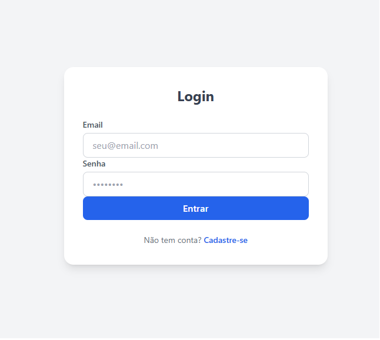
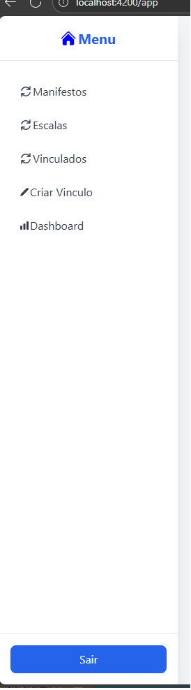
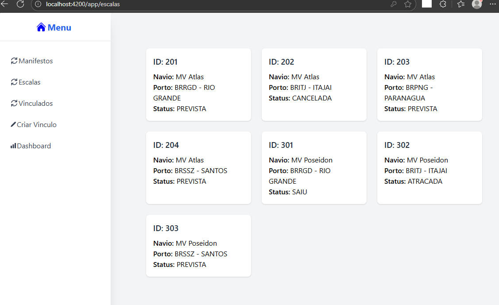
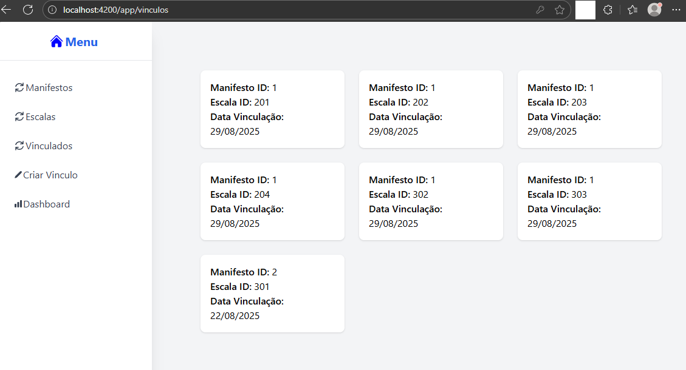
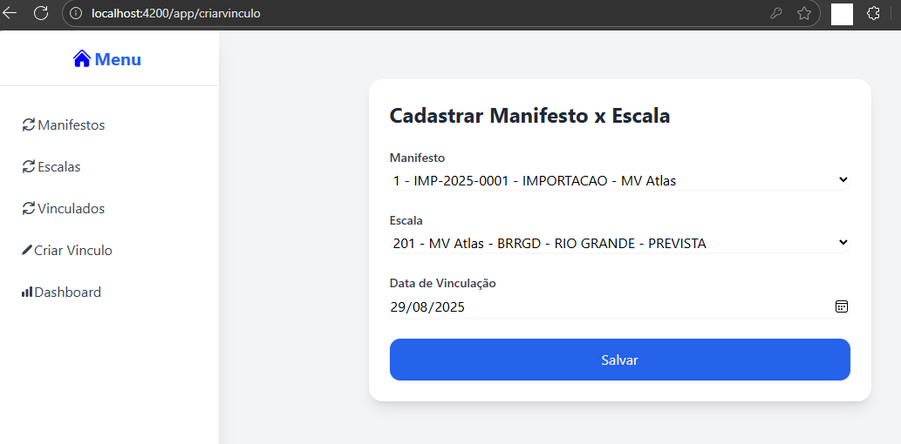
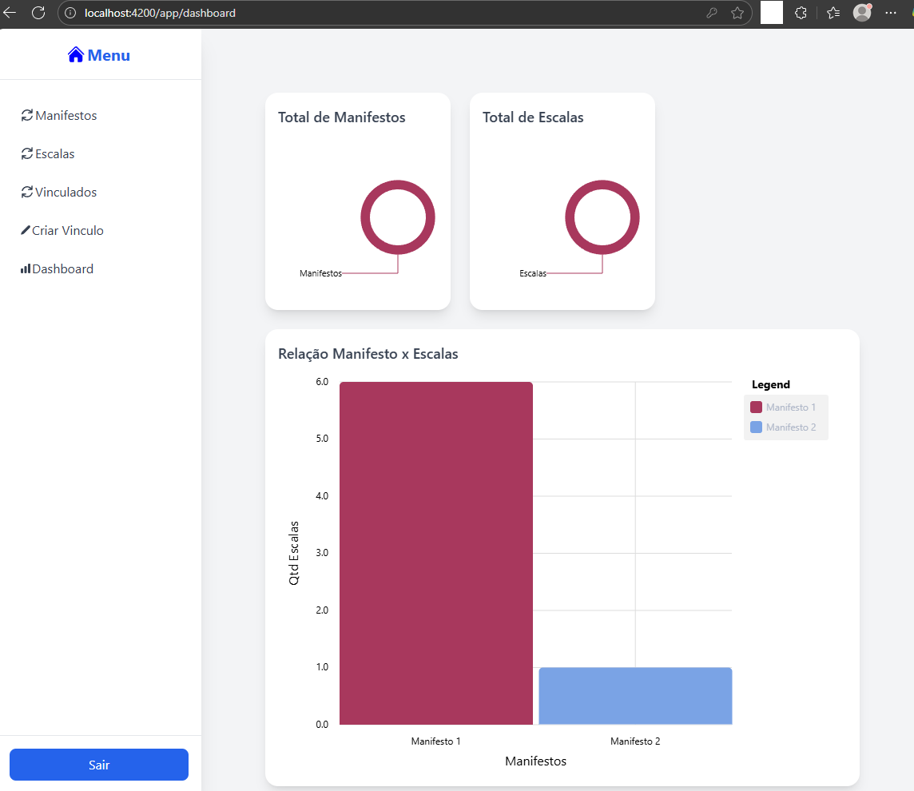
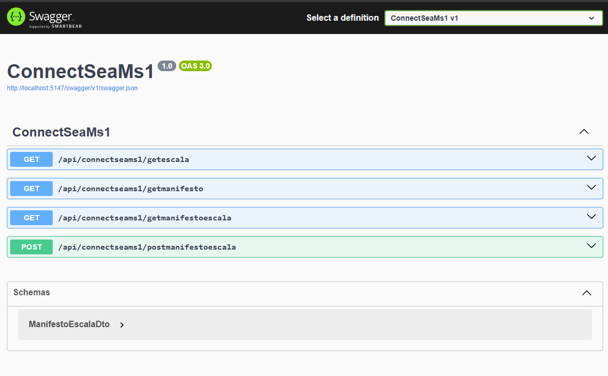
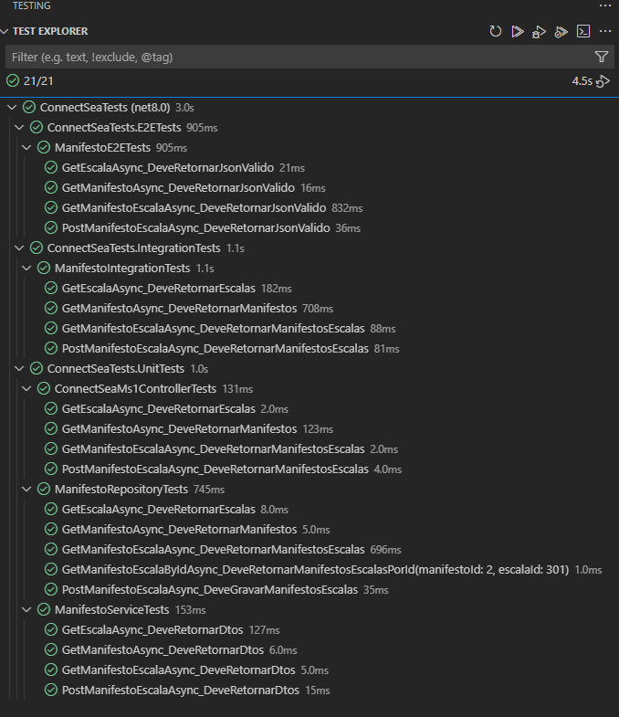

# 🚢 Sistema de Logística Portuária  

[](https://angular.io/)  
[](https://tailwindcss.com/)  
[](https://dotnet.microsoft.com/)  
[](https://swagger.io/)  

Um sistema moderno e elegante para **gestão de manifestos, escalas e vínculos entre eles**, com visualizações gráficas e backend robusto.  

---

## 🖥️ Frontend

- Desenvolvido em **Angular 20**  
- Estilização com **TailwindCSS**  
- Componentes modernos e responsivos  

### 🔧 Instalação & Execução

```bash
cd frontend-angular
npm install
npm start
```

📊 Telas do Frontend

exemplo: teste@email.com, qualquerSenha




📄 Consulta de Manifestos


⚓ Consulta de Escalas



🔗 Consulta de Manifestos x Escalas



🔗 Criação de Manifestos x Escalas



📈 Dashboard de Gráficos



Visualização gráfica da correlação entre Manifestos, Escalas e Vínculos.


## ⚙️ Backend

- Criado com .NET 8
- Banco de dados em Entity Framework InMemory (sem necessidade de setup adicional)

### 🔧 Execução

```bash
cd backend-microservice1
cd ConnectSeaMs1
dotnet run
```

API documentada com Swagger

🌐 Swagger Principal

✨ Destaques do Projeto

🧩 Arquitetura modular e organizada

🎨 UI moderna e responsiva

⚡ Backend leve e performático

📊 Visualização clara dos relacionamentos

🚀 Fácil de instalar e rodar

📌 Estrutura de Imagens no Projeto



## ⚙️ Testes no Backend com XUnit

- Teste unitário
- Teste de integração
- Teste End-To-End

###

```bash
dotnet test
```
📌 Estrutura de Imagens dos Testes



## Build e Deploy no Kubernetes

Para criar as imagens Docker do backend e frontend e aplicar os manifestos no Kubernetes, siga os comandos abaixo na pasta raiz:

```bash
# Build da imagem do backend
docker build -t connectseams1api:1.0 ./backend-microservice1

# Build da imagem do frontend
docker build -t frontend-angular:1.0 ./frontend-angular/connect-sea-ui

# Aplicando os manifestos do backend
kubectl apply -f backend-microservice1/k8s/

# Aplicando os manifestos do frontend
kubectl apply -f frontend-angular/connect-sea-ui/k8s/
```

Acessando a aplicação


Frontend: disponível em http://localhost:30082

